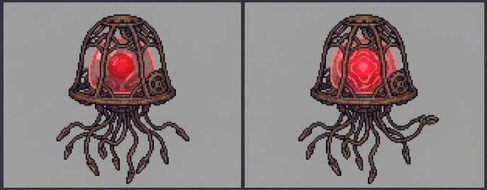
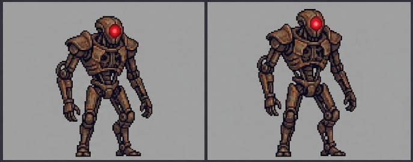
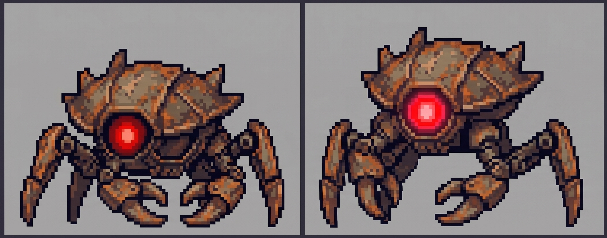

# Manny Obstacle Run

<p align="center">
  
</p>

A fast-paced 2D obstacle runner built with **Next.js**, **React**, and **HTML Canvas**. Dodge, jump, punch, and collect coins as you run endlessly through a procedurally generated landscape.

---

## Gameplay

You control **Manny**, who automatically runs from left to right. Your goal is to survive as long as possible by avoiding obstacles, destroying them with punches, and collecting coins.

### Controls

| Action | Keyboard | Mouse |
|--------|----------|-------|
| Jump | `W` / `Arrow Up` / `Space` | -- |
| Duck | `S` / `Arrow Down` | -- |
| Punch | `D` / `Arrow Right` | Click |
| Start / Retry | Any key | -- |

### Scoring

| Action | Points |
|--------|--------|
| Dodge an obstacle (duck or jump) | +1 |
| Punch a **Scrap-Mite** | +2 |
| Punch an **Aero-Jelly** | +3 |
| Punch a **Hollow Stalker** | +4 |

### Obstacles

| Sprite | Name | Description |
|--------|------|-------------|
|  | **Aero-Jelly** | A floating jellyfish-like enemy. Duck under it to avoid. |
|  | **Hollow Stalker** | A tall ground enemy. Can be punched for the highest score. |
|  | **Scrap-Mite** | A small ground enemy. Low profile makes it tricky. |

### Bullets (KO-Spark)

Each enemy can fire **KO-Spark** bullets at random intervals. Bullets **cannot be punched** -- you must dodge them.

- **Aero-Jelly & Hollow Stalker bullets**: Mid-height -- dodge by **ducking** or **jumping**.
- **Scrap-Mite bullets**: Low to the ground -- must be **jumped** over (ducking won't help).

### Coins

Collect gold coins that appear at random heights for bonus points. Coin count is tracked separately.

---

## Project Structure

```
public/
  manny.png          -- Game mascot / favicon
  idle.jpg           -- Idle sprite sheet (4 frames)
  runn.jpg           -- Run sprite sheet (6 frames)
  duck.jpg           -- Duck sprite sheet (4 frames)
  jump.jpg           -- Jump sprite sheet (4 frames)
  punch.jpg          -- Punch sprite sheet (4 frames)
  aero-jelly.jpg     -- Aero-Jelly obstacle sprite (2 frames)
  hollow.jpg         -- Hollow Stalker obstacle sprite (2 frames)
  mite.png           -- Scrap-Mite obstacle sprite (2 frames)
  bullet.png         -- KO-Spark bullet sprite
  coin.png           -- Collectible coin sprite
  bg.png             -- Parallax background

app/
  page.tsx           -- Main game component (canvas, logic, UI)
  layout.tsx         -- Root layout with metadata and favicon
  globals.css        -- Global styles
```

---

## Tech Stack

- **Framework**: Next.js (App Router)
- **Language**: TypeScript
- **Rendering**: HTML5 Canvas (2D context)
- **State**: React `useRef` for per-frame game state, `useState` for UI-bound values
- **Animation**: `requestAnimationFrame` game loop (60fps)
- **Deployment**: Vercel-ready

---

## Running Locally

```bash
npm install
npm run dev
```

Open [http://localhost:3000](http://localhost:3000) in your browser.

---

## Build

```bash
npm run build
npm start
```

---

## Features

- Procedurally generated obstacles with increasing difficulty
- Three enemy types with unique behaviors and scoring
- Bullet system with different dodge requirements per enemy
- Coin collection for bonus points
- Punch mechanic to destroy obstacles
- Score popups and particle effects
- High score saved to localStorage
- Mobile-friendly with landscape orientation lock
- Fullscreen support with letterboxing
- Responsive scoring guide and controls display
